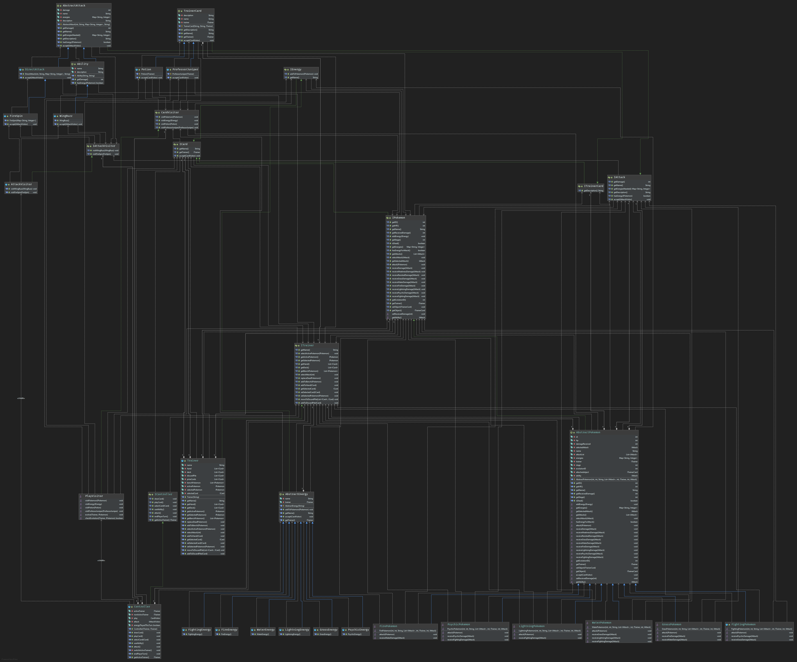

# Pokemon TCG: Basic Elements

This repository contains the basic elements of a Pokemon TCG clone, these include
the cards, the pokemon, energies, attacks and a representation of the player (as a trainer).

There are 5 types of entities represented as interfaces: ITrainer represents the player
of the game and contains several methods that allow different interactions between
the cards and the pokemon of the player. IPokemon defines methods for interactions between pokemon,
including attacking and receiving attacks. IAttack defines how attacks work, including the interaction between them and energies.
IEnergy contains methods for the interactions between pokemon and energies. Finally, 
the ICard interface has common methods for both IPokemon and IEnergy, considering both entities can be used as cards.

Most of the interactions between the different entities described before where implemented using double dispatch as it works great
with the weakness/resistance system of Pokemon.

## How to Run
The code was made in Java 8 with the JUnit 4 FrameWork, and should be able to run on any machine with a jvm version 8 or above.

The package doesn't contain a main method, but the main functionality of each class is showed in the test subpackage.
There are test methods for most of the methods present in the individual classes (some methods are called indirectly or from
another test, so there is not full correspondence between the quantity of methods and tests), and they can be executed on the 
JUnit 4 FrameWork.

## About Tests
The tests for the classes Trainer, DireckAttack and Energies are pretty straightforward as there is
1 test for every method of the corresponding class.

The tests for the different types of pokemon all follow a similar structure: the first test makes sure
the constructor works correctly, and doesn't allow pokemon with more than 4 attacks (if there is more, it just takes the first 4).
The second test tests whether the pokemon is dead or not after an attack.
The third test makes sure a pokemon has enough energy to perform and attack. The fourth and final test shows the bulk of the logic behind the weaknesses
and resistances of a pokemon and contains implicit calls to the methods of AbstractPokemon
making use of double dispatch instead of asking for the pokemon type.

## UML Diagram of the Package
